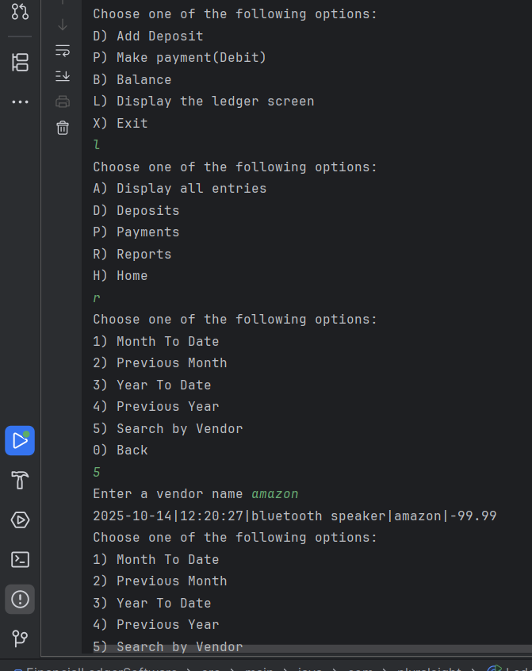
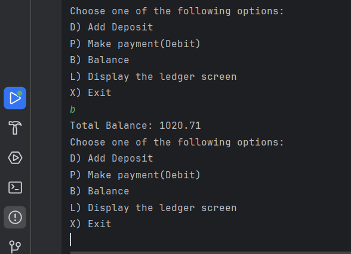

# 💰 Financial Tracker Application

A command-line app for tracking financial transactions — personal or business. Record deposits and payments, check your balance, and generate time-based reports, all saved to a local file.
Built to practice core Java: file I/O, data modeling, menu-driven console UIs, and date/time handling.

## Features

- Add **deposits** and **payments**, each auto-stamped with date and time
- View a running **balance** on demand
- Browse the **ledger**: all entries, deposits only, or payments only
- **Reports**: Month-to-Date, Previous Month, Year-to-Date, Previous Year, and Search by Vendor
- Data persists to a local `transactions.csv` file between runs

## Screenshots
***Differents screens:***



***Total Balance feature:***



## Tech Stack

Java 17 · Maven · standard library only (no external dependencies)

## Getting Started

```bash
git clone https://github.com/DzmitryCharnamortsau/Financial-Tracker-Application.git
cd Financial-Tracker-Application
mvn compile
java -cp target/classes com.pluralsight.Ledger
```
A transactions.csv file is created automatically on your first entry.


## How it works
Transactions are stored one per line, pipe-delimited:

date|time|description|vendor|amount
2025-10-16|14:32:05|Paycheck|Acme Corp|1500.00
2025-10-16|18:05:41|Groceries|Whole Foods|-84.27

Deposits are stored as positive amounts and payments as negative, so the balance is just the sum of all entries.

## Project Structure

```
src/main/java/com/pluralsight/
├── Ledger.java         # Entry point
├── MainMenu.java       # Menus, input handling, file I/O, reports
└── Transactions.java   # Transaction data model
```
